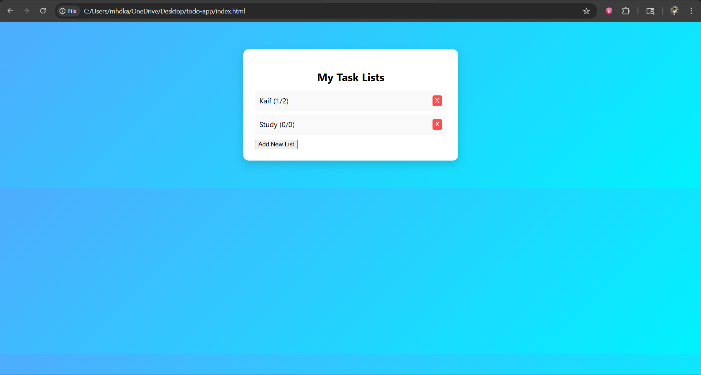
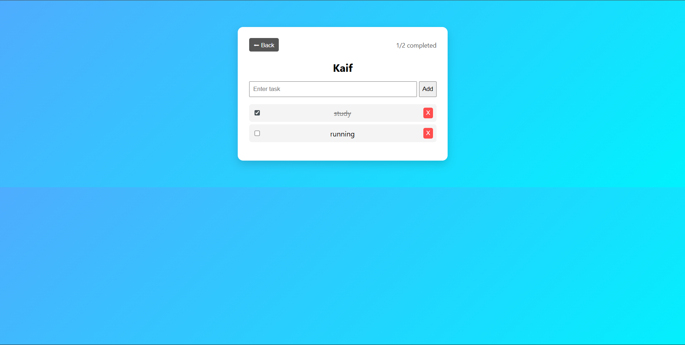

# 📝 Smart Task Manager

A simple multi-page To-Do web application built using HTML, CSS, and JavaScript.

---

## 🚀 Features

- Create multiple task lists
- Add, delete, and manage tasks
- Mark tasks as completed using checkbox
- View progress (completed tasks count)
- Multi-page navigation (Dashboard + Task Page)
- Data stored using LocalStorage

---

## 📂 Project Structure

todo-app/
│── index.html
│── tasks.html
│── style.css
│── script.js

---

## 🖥️ Screenshots

### 📋 Dashboard

### 📄 Task Page

---

## ⚙️ Technologies Used

- HTML
- CSS
- JavaScript
- LocalStorage

---

## 🎯 How to Run

1. Download or clone the repository
2. Open index.html in browser
3. Start using the app

---

## 📌 Author

- Mohammad Kaif
